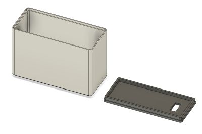
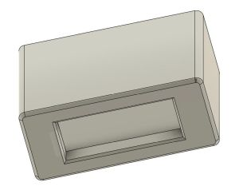
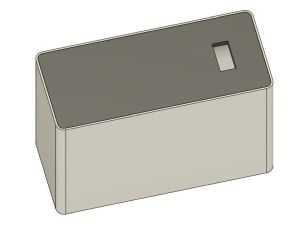
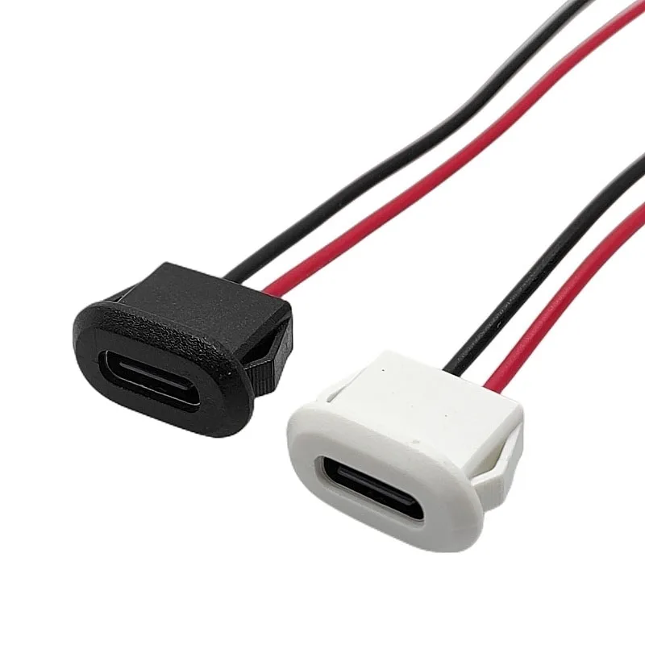

# Модель корпуса часов BananaClock для самостоятельной печати

### Описание
Корпус часов задумывался максимально простым и уже учитывает усадку PETG пластика. Зазор между деталями минимальный, благодаря чему сборка не требует клея и винтов.

Размеры отверстия фронтальной стороны корпуса (50.8мм x 19.6мм) подходят для дисплея TM1637 4-digit 0.56". Я использовал от компании RobotDyn, но другие тоже должны подойти.

Внутри корпуса можно разместить Wemos D1 Mini, DS3231 и пищалку с пучком проводов для навесного монтажа. 

Отверстие на задней крышке (12.3мм x 5.8мм) предусмотрено для пластикового гнезда Type-C. У таких гнёзд очень хрупкие уплотнители, поэтому я срезаю их лезвием.

