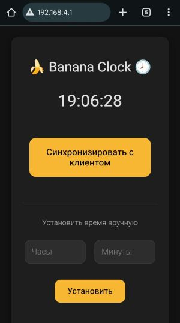

# Автономные часы с веб-интерфейсом на Wemos D1 Mini v4, TM1637 и DS3231

### Инструкция по сборке и установке
#### Сборка устройства
1. TM1637 CLK  →  D5 (GPIO14)
2. TM1637 DIO  →  D6 (GPIO12)
3. DS3231 SDA  →  D2 (GPIO4)
4. DS3231 SCL  →  D1 (GPIO5)
5. [Опционально] Buzzer → D7 (GPIO13)

#### Установка прошивки
1. Установить Arduino IDE 2.x.x
2. Скачать [плагин](https://github.com/earlephilhower/arduino-littlefs-upload/releases) LittleFS для Arduino IDE 2.x.x
3. Поместить .vsix файл в *C:\Users\\username\\.arduinoIDE\\*
4. Запустить Arduino IDE
5. Установить библиотеки
   - TM1637 by Avishay Orpaz
   - RTClib by Adafruit
6. Подключить Wemos D1 Mini к компьютеру и выбрать COM порт
5. Загрузить прошивку Ctrl+U
6. Загрузить файлы Ctrl+Shift+P > Upload LittleFS

### Настройка

При первом запуске нужно установить время.

1. Подключиться к WiFI точке "BananaClock", используя пароль banana1234
2. Перейти по любому адресу через браузер
- http://banana.local
- http://192.168.4.1
3. Нажать кнопку "Синхронизировать с клиентом" или ввести время вручную
4. При необходимости можно изменить яркость дисплея. Настройки яркости сохраняются в EEPROM
